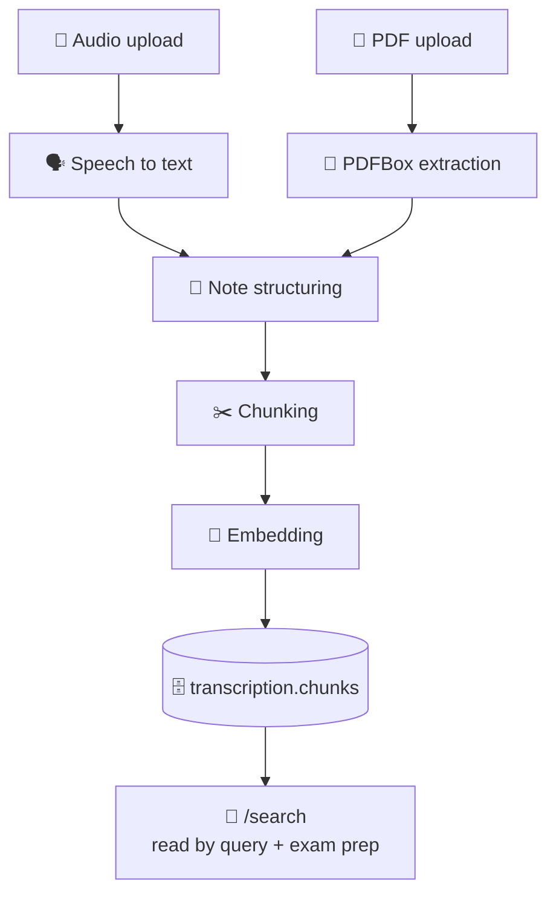

<div align="center">

# 🎙️ Cleveft Transcription Service

**Lecture in, searchable knowledge out.**

Turns a recording into a transcript, structured notes and vector chunks — and
serves as the retrieval endpoint every other service reads from.

<br/>


</div>

---

## 🧭 The pipeline

An upload returns **immediately** with a lecture ID; processing runs on a
background worker and the client polls `/{lectureId}/status`.



Each stage is recorded, so a lecture that fails part-way can be resumed with
`/{lectureId}/retry` rather than re-uploaded.

The second entry point matters: a PDF posted to `/documents` skips
speech-to-text entirely and joins the same pipeline at note structuring. Slide
decks and handouts therefore become queryable exactly like a recording.

> [!IMPORTANT]
> `transcription.chunks` is the only vector table in the system. The query and
> exam-prep services retrieve context by calling `/search` here — never by
> reading pgvector themselves.

---

## 🔌 API

> Base path `/api/v1/transcriptions` · all routes require a bearer token

<details open>
<summary><b>📥 Ingestion</b></summary>

<br/>

| Method | Path | Description |
| :--- | :--- | :--- |
| `POST` | `/` | Upload lecture audio (multipart); returns a lecture ID |
| `POST` | `/documents` | Upload a PDF (multipart); same pipeline, no audio |
| `GET` | `/{lectureId}/status` | Pipeline progress, polled after upload |
| `POST` | `/{lectureId}/retry` | Re-run a failed pipeline |

</details>

<details open>
<summary><b>📚 Lectures</b></summary>

<br/>

| Method | Path | Description |
| :--- | :--- | :--- |
| `GET` | `/` | List the student's lectures |
| `GET` | `/{lectureId}` | A lecture with its transcript and notes |
| `PATCH` | `/{lectureId}` | Rename, or assign to a course |
| `DELETE` | `/{lectureId}` | Delete a lecture and its chunks |
| `GET` | `/stats` | Counts for the dashboard |
| `GET` | `/usage` | Recordings used this month against the plan quota |

</details>

<details open>
<summary><b>🔎 Retrieval</b></summary>

<br/>

| Method | Path | Description |
| :--- | :--- | :--- |
| `POST` | `/search` | Vector search over chunks — used by other services |

</details>

---

## ⚙️ Configuration

<details>
<summary><b>Environment variables</b></summary>

<br/>

| Variable | Default | Purpose |
| :--- | :--- | :--- |
| `GOOGLE_API_KEY` | — | Gemini credentials |
| `GEMINI_STT_MODEL` | `gemini-3.5-flash` | Speech to text; compose overrides to `flash-lite` |
| `GEMINI_NOTES_MODEL` | `gemini-3.5-flash` | Transcript → structured notes |
| `GEMINI_EMBEDDING_MODEL` | `gemini-embedding-001` | Chunk embeddings |
| `AUTH_SERVICE_URL` | `http://localhost:8084` | Reads the student's plan before an upload |
| `MAX_UPLOAD_SIZE` | `200MB` | A one-hour lecture lands well under this |
| `RETAIN_AUDIO` | `true` | Keep the source audio after processing |
| `AUDIO_STORAGE_PATH` | `./data/audio` | Where it is kept |
| `DB_HOST` / `DB_PORT` | `localhost` / `5433` | PostgreSQL |

Settings live in `src/main/resources/application.yml`. See `.env.example`.

</details>

### 🎛️ Why three different models

Every Gemini model has its own free-tier quota pool, so which call uses which
model decides what breaks first. Speech-to-text and note structuring sit on
**different** models deliberately — otherwise importing a PDF could be refused
because a lecture was transcribed an hour earlier. Embeddings have their own
pool again.

> [!WARNING]
> Left at its default inside a container, `AUTH_SERVICE_URL` points at this
> service itself. The plan lookup then fails and the quota check **fails open** —
> every account behaves as unlimited and the free tier stops meaning anything.

> [!NOTE]
> The embedding width is fixed at **768** and must equal the `vector(n)` column
> width in `cleveft-infra/init.sql`.

---

## 🚀 Running it

**With the full stack**

```bash
cd ../cleveft-infra
docker compose --profile services up -d --build
```

**On its own, against the shared database**

```bash
cd ../cleveft-infra && docker compose up -d   # postgres only
cd ../cleveft-transcription-service && mvn spring-boot:run
```

> [!NOTE]
> Requires Java 21 and a PostgreSQL instance with `pgvector` enabled, carrying
> the `transcription` schema from
> [`cleveft-infra/init.sql`](https://github.com/Cleveft-Project/cleveft-infra).
> Hibernate runs with `ddl-auto: none`, so this service never creates or alters
> a table.

---

<div align="center">
<sub>Part of the <a href="https://github.com/Cleveft-Project">Cleveft</a> platform</sub>
</div>
